# Diagramming

## Workflow

1. **Select diagram type** -- Match the visualization need to the right Mermaid diagram (see table)
2. **Define scope** -- One diagram per concept; split complex systems into levels
3. **Draft structure** -- Identify nodes, relationships, and labels
4. **Write Mermaid syntax** -- Use the examples below as templates
5. **Validate** -- Render in a Mermaid-compatible viewer; check readability and label clarity

## Diagram Type Selection

| Diagram Type | Use When |
|---|---|
| C4 Context/Container | Showing system boundaries, services, and external dependencies |
| Sequence | Documenting request flows, API interactions, async processing |
| ERD | Modeling database tables, relationships, and cardinality |
| Flowchart | Mapping decision logic, CI/CD pipelines, process flows |
| State | Defining state machines, order lifecycles, connection states |
| Class | Documenting object hierarchies and interfaces |

## Principles

- One diagram, one concept -- split large diagrams into levels
- Always label relationships and transitions with descriptive text
- Use consistent naming across related diagrams
- Prefer left-to-right or top-to-bottom flow for readability
- Include a title for context

## Examples

### Architecture Diagrams (C4 Model)

#### Context Diagram (Level 1)

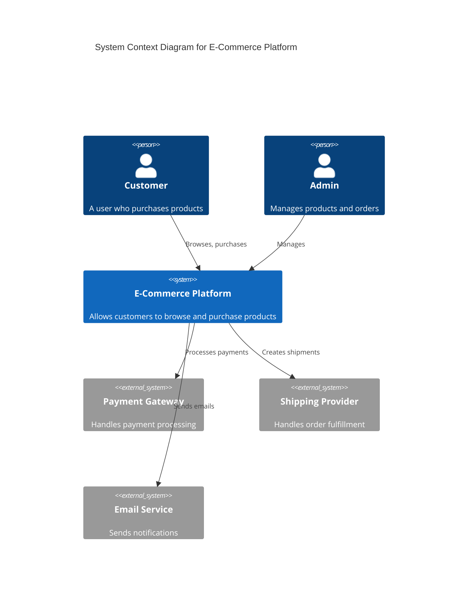

#### Container Diagram (Level 2)

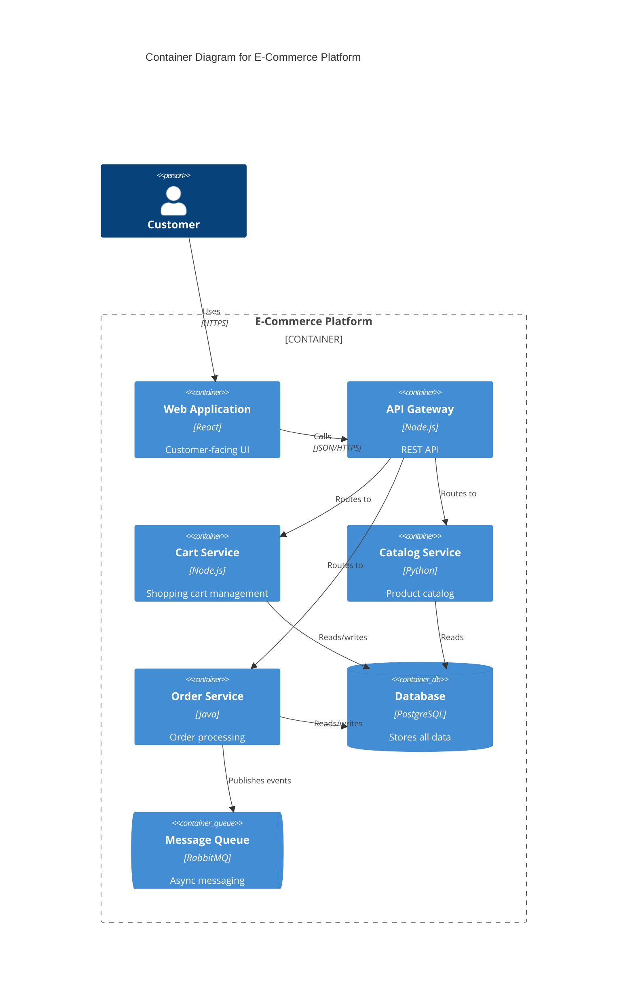

#### Component Diagram (Level 3)

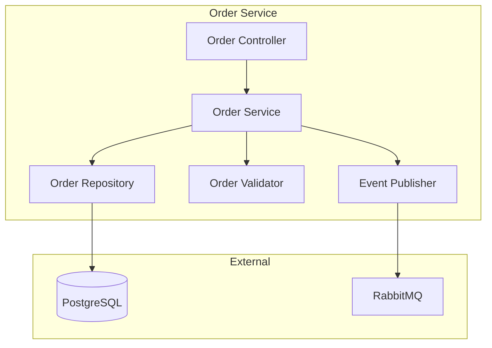

### Sequence Diagrams

#### Basic Request Flow

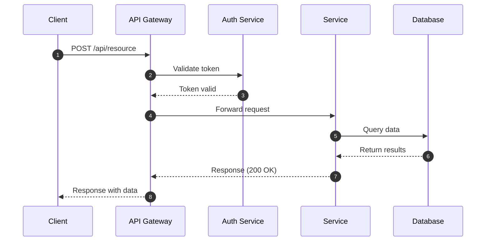

#### Error Handling Flow

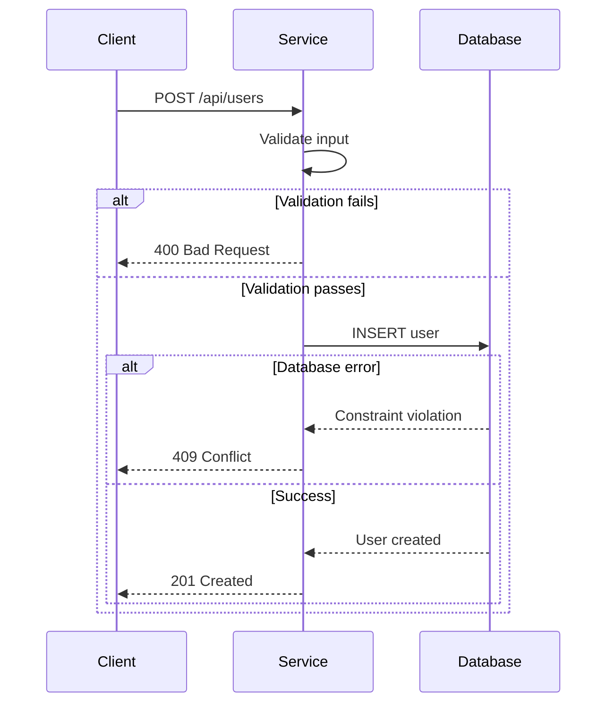

#### Async Processing

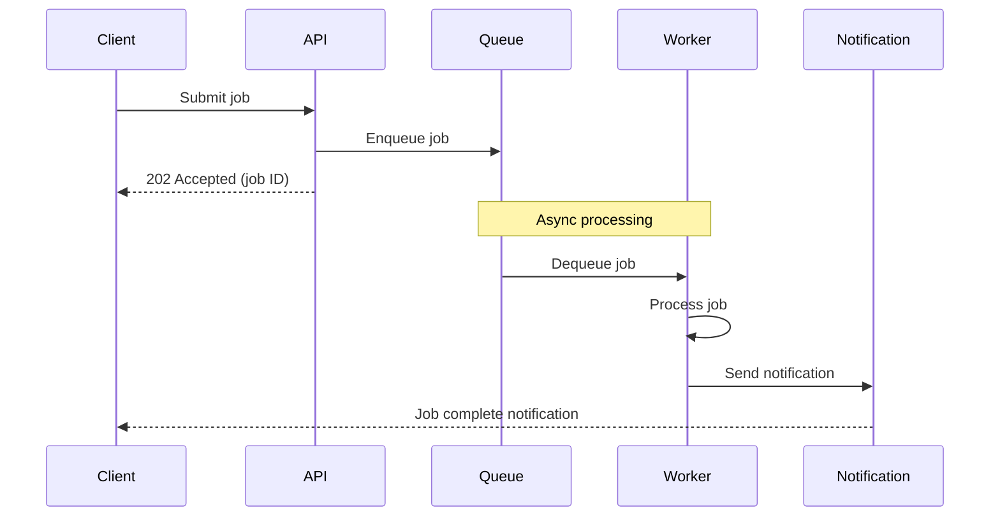

### Entity-Relationship Diagrams

#### Basic ERD

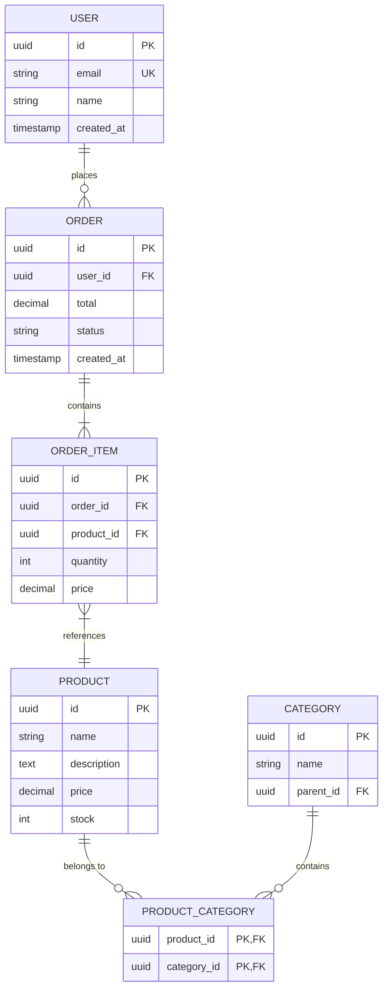

#### ERD with Relationships Explained

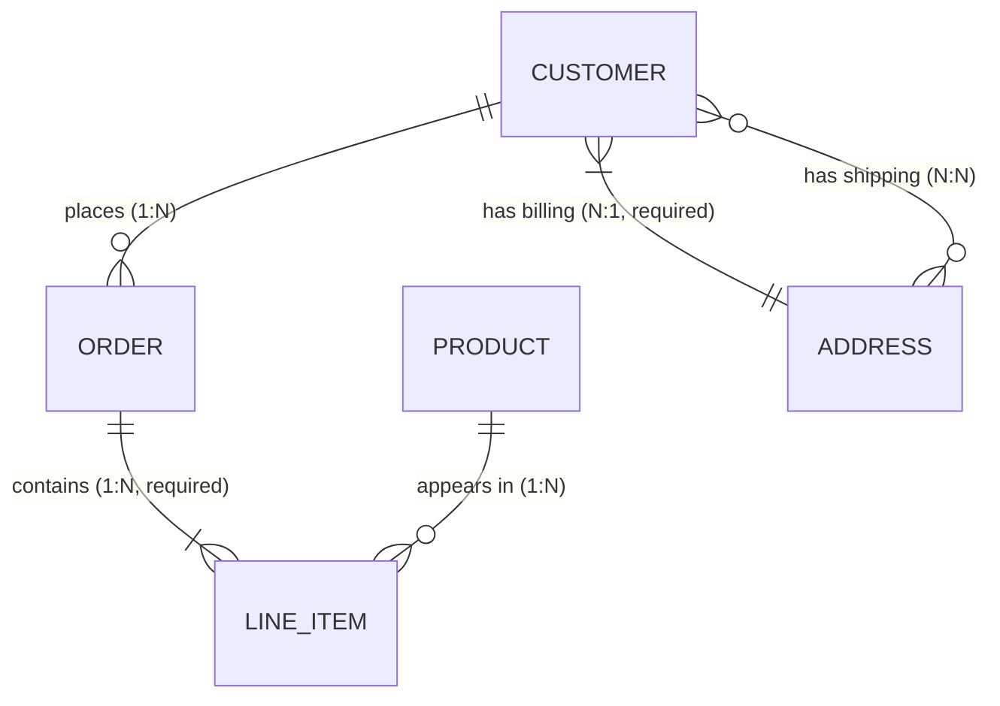

Relationship notation:

- `||` exactly one
- `o|` zero or one
- `}|` one or more
- `}o` zero or more

### Flowcharts

#### Decision Logic

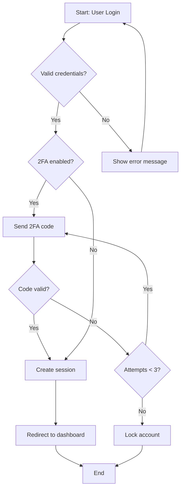

#### Process Flow

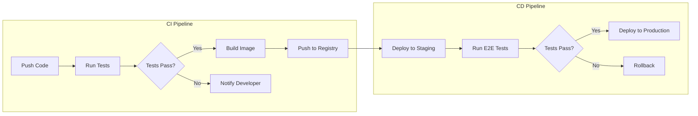

### State Diagrams

#### Order State Machine

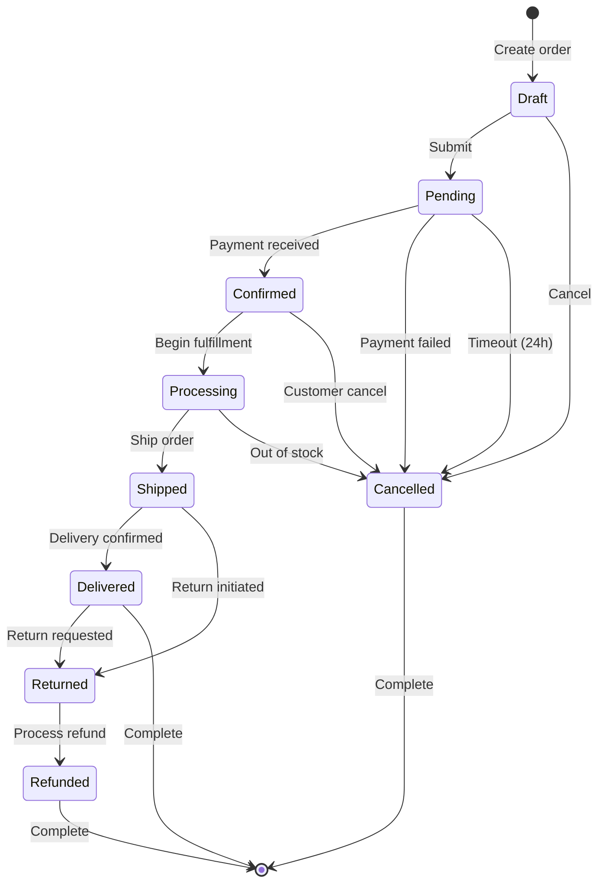

#### Connection State Machine

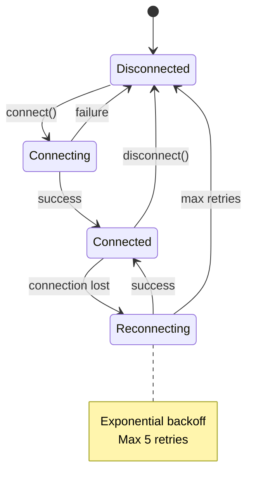

### Class Diagrams

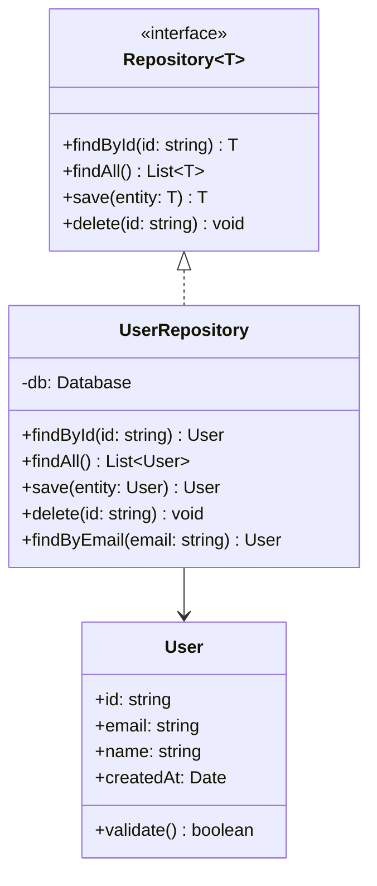
